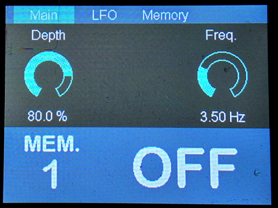
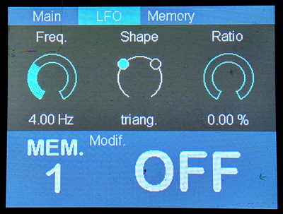
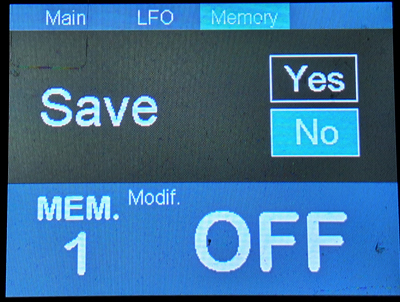

# PENDA Software

## 🚀 New Release: MIDI Protocol Support!
## Introduction
PENDA Software is an advanced framework tailored for the **PENDA Hardware** platform [GitHub Link](https://github.com/DADDesign-Projects/PENDA-Hardware), enabling effortless development of high-quality audio effect pedals. Designed to streamline development, it allows creators to focus entirely on signal processing while the framework manages hardware complexities.

## Author
This project is developed by DAD Design.

## Key Features
- **Full Integration**: Seamlessly works with **PENDA Hardware** and **DAISY Seed**.
- **Optimized Audio Processing**: Built-in support for **Audio CODEC**, handling initialization and real-time processing.
- **Memory Management**:
  - **SDRAM** for efficient data storage.
  - **QSPI Flash** for fast, non-volatile storage, including file persistence and flashing utilities.
- **Graphical User Interface (GUI)**:
  - **TFT Display** with **ST7789** driver support.
  - **DaisySeedGFX2** for advanced UI visualization and customization.
  - Interactive controls via **footswitches** (tap tempo), **encoders** and **MIDI protocol**.
- **Development Environment**: Built with **STM32Cube**, offering modular and extensible architecture for easy customization.

With **PENDA Hardware**, this framework provides an all-in-one solution for pedal effect development, eliminating the need for low-level hardware management.

## Feedback
I would be very happy to receive your feedback on the use of this project. If you've worked on any projects using PENDA Software or have suggestions, bug reports, or any questions, don't hesitate to contact me!

## Resources
- **PENDA-Hardware Repository**: [GitHub Link](https://github.com/DADDesign-Projects/PENDA-Hardware)
- **DaisySeedGFX2 Repository**: [GitHub Link](https://github.com/DADDesign-Projects/DaisySeedGFX2)
- **Daisy_QSPI_Flasher Repository**: [GitHub Link] (https://github.com/DADDesign-Projects/Daisy_QSPI_Flasher)

## License
PENDA Software is released under the **MIT License**.

## TREMOLO DEMO
### Encoder Controls

- **Encoder 0 (Right):**  
  Scroll through the menu

- **Encoders 1/2/3 (Above display):**  
  Adjust the displayed parameter below  
  *(Pro tip: Press + turn simultaneously for precision adjustment)*

### Memory Screen Functions
- **Encoder 1 (Top left):** Select function → `Save` / `Restore` / `Erase`
- **Encoder 2 (Top center):** Select target memory slot
- **Encoder 3 (Top right):**  
  - Switch to `Yes` to confirm  
  - Press to execute action

> **Important Notes:**  
> - Cannot erase currently active memory  
> - Cannot restore/erase never-saved slots

### Footswitch Controls

#### Footswitch 1
- **Short press:** Cycle memory presets  
- **Long press (1.5s):** Toggle effect On/Off

#### Footswitch 2
- **Tap tempo:** Controls tremolo rate

### MIDI Controls
CC#20 Depth
CC#21 Shape
CC#22 Freq.
CC#23 Ratio
CC#48 Preset Down
CC#49 Preset Up
CC#50 ON/OFF
CC#51 ON
CC#52 OFF
PC#x  Preset x

### GUI Screenshot

