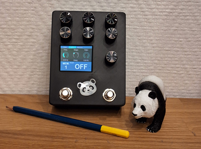

# PENDA Software

## Introduction
PENDA Software is an advanced framework tailored for the **PENDA Hardware** platform, enabling effortless development of high-quality audio effect pedals. Designed to streamline development, it allows creators to focus entirely on signal processing while the framework manages hardware complexities.

## Author
This project is developed by DAD Design.

## Key Features
- **Full Integration**: Seamlessly works with **PENDA Hardware** and **DAISY Seed**.
- **Optimized Audio Processing**: Built-in support for **Audio CODEC**, handling initialization and real-time processing.
- **Memory Management**:
  - **SDRAM** for efficient data storage.
  - **QSPI Flash** for fast, non-volatile storage, including file persistence and flashing utilities.
- **Graphical User Interface (GUI)**:
  - **TFT Display** with **ST7789** driver support.
  - **DaisySeedGFX2** for advanced UI visualization and customization.
  - Interactive controls via **footswitches** (tap tempo) and **encoders**.
- **Development Environment**: Built with **STM32Cube**, offering modular and extensible architecture for easy customization.

With **PENDA Hardware**, this framework provides an all-in-one solution for pedal effect development, eliminating the need for low-level hardware management.

## Feedback
I would be very happy to receive your feedback on the use of this project. If you've worked on any projects using PENDA Software or have suggestions, bug reports, or any questions, don't hesitate to contact me!

## Resources
- **PENDA-Hardware Repository**: [GitHub Link](https://github.com/DADDesign-Projects/PENDA-Hardware)
- **DaisySeedGFX2 Repository**: [GitHub Link](https://github.com/DADDesign-Projects/DaisySeedGFX2)

## License
PENDA Software is released under the **MIT License**.

## Images

