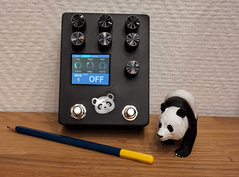

[](https://opensource.org/licenses/Apache-2.0)


# PENDA Software


# 🎸 PENDA Software

Software for the **PENDA** digital audio effects pedal platform.
>**Important: New version with major changes — restructured and integrated the FORGE framework**
## 🛠 Hardware Overview

The PENDA platform is built around a **Daisy Seed** mounted on a custom-designed carrier board.

**Core (Daisy Seed)**

* STM32H750 MCU
* 64 MB SDRAM
* 8 MB QSPI Flash
* PCM3060 high-quality stereo audio codec
* USB connectivity and onboard debugging

**Carrier Board**

* Display management
* User controls (potentiometers and rotary encoders)
* Audio input/output stage with impedance matching and signal conditioning

## 💻 Software Architecture

The software is built on top of the **FORGE** framework, a modular platform dedicated to the development of digital audio effects for guitar, vocals, keyboards, and other audio applications.

This repository implements the Board Support Package (BSP) for the PENDA platform. It initializes and configures all STM32 hardware interfaces according to the PENDA hardware design and creates the FORGE framework objects with the appropriate hardware-specific parameters (audio, display, controls, storage, and peripherals).

>*By separating the hardware initialization from the application logic, the same FORGE effect modules can be reused across different hardware platforms with minimal changes*.  

## 🎛️ Available Effects

The project includes several ready-to-use build configurations that generate complete digital audio effects based on the high-level processing modules provided by the FORGE framework.

The currently available examples include:

Reverberation
Delay
Modulation effects (Chorus, Flanger, Tremolo, Vibrato, Phaser, etc.)

These projects can be used as-is, customized to fit your own requirements, or simply serve as reference implementations and starting points for learning how to develop your own digital audio effects.

## 🚀 RAM Execution and Flash Loader

To maximize execution performance, simplify debugging, and overcome the 128 KB Flash limitation of the STM32H750 internal memory, all applications are compiled for execution from internal RAM.

During development, the debugger automatically loads the application into RAM, providing a fast edit-build-debug cycle.

For standalone operation, the generated ELF executable is transferred to the external QSPI Flash memory located on the Daisy Seed. At power-up, a resident bootloader copies the application into RAM and starts its execution.

The deployment process is fully automated using the OSCAR_Flasher_Server and PENDA_FlasherLoader utilities, making it easy to build, upload, and launch applications without requiring any manual flashing steps.

## 🚀 Getting Started

Clone the repository
``` bash
git clone --recurse-submodules https://github.com/DADDesign-Projects/PENDA-Software
```

Load the files from the FORGE/Resources directory into the external flash drive. Use the QSPI Flasher utility: https://github.com/DADDesign-Projects/OSCAR_P01_FlasherClient

Modify debug build configuration for STM32CubeIDE 
Use an ST-LINK or compatible debug probe

Documentation and tutorials for framfork FORGE available here: (https://daddesign-projects.github.io/OSCAR_Documentation/)

## 📄 License
This project is licensed under the Apache 2.0 License (https://opensource.org/licenses/Apache-2.0).

## 🔗 Related Projects
- PENDA-Hardware: https://github.com/DADDesign-Projects/PENDA-Hardware
- PENDA_FlasherLoader: https://github.com/DADDesign-Projects/PENDA_FlasherLoader
- OSCAR_Flasher_Server: https://github.com/DADDesign-Projects/OSCAR_Flasher_Server
- OSCAR_PY_Flasher_Server: https://github.com/DADDesign-Projects/OSCAR_PY_Flasher_Server
- DAD_FORGE: https://github.com/DADDesign-Projects/DAD_FORGE
- TrueType-to-Bitmap-Converter: https://github.com/DADDesign-Projects/TrueType-to-Bitmap-Converter

  
## 📬 Contact
If you have questions, suggestions, bug reports, or ideas for improving the FORGE framework or the PENDA platform, feel free to get in touch.

Contributions, feedback, and community participation are always welcome.

**Email**
📧 daddesign.projects@gmail.com

**Facebook**
🎛️🎶 Follow all the latest news, project progress, and demonstrations on my Facebook page!

https://www.facebook.com/people/DADDesign-Projects/61583645957068/
